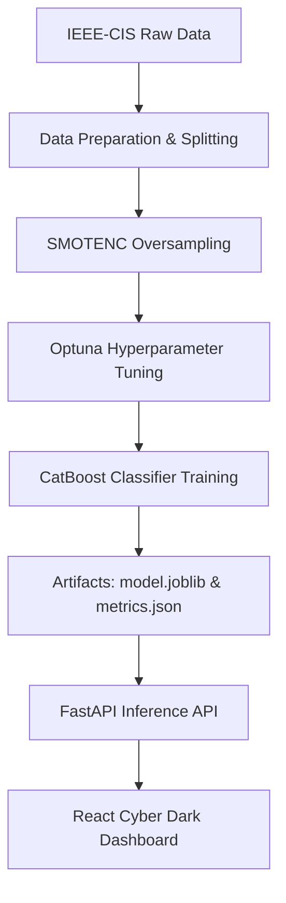

# 🛡️ ShieldML: Real-time Fraud Intelligence Command Center

ShieldML is a portfolio-grade, production-ready fraud detection monorepo developed as a master's thesis project. The system combines state-of-the-art gradient boosted classification (CatBoost) with explainable AI frameworking (SHAP), dynamic business impact models, and feature drift detection pipelines.

---

## 🏛️ System Architecture & MLOps Pipeline



ShieldML is built across three primary components:
1. **Machine Learning Pipeline (`backend/scripts`):** Integrates dataset split curation, SMOTENC oversampling, Bayesian optimization (Optuna), and drift statistics.
2. **FastAPI Backend Service (`backend/app`):** Powering live inference scoring, Shapley explanations, cost-sensitive matrices, and validation metrics endpoints.
3. **React + TypeScript Frontend (`frontend`):** A high-fidelity, dark-themed MLOps dashboard supporting multi-tab navigation, transaction simulations (with preset profiles), feature drift charts, and architectural guides.

---

## 🔬 Core Methodologies & Formulations

### 1. SMOTENC Class Imbalance Handling
Real-world fraud databases are heavily skewed (e.g. 96.6% legitimate, 3.4% fraud). Standard classifiers fail by optimizing for the majority class. **SMOTENC** (Synthetic Minority Over-sampling Technique for Nominal and Continuous data) generates synthetic minority examples in continuous and categorical feature spaces by interpolating neighbor boundaries:
$$x_{new} = x_i + \lambda (x_{zi} - x_i)$$
*   $x_i$: Target minority instance.
*   $x_{zi}$: Neighbor instance selected from $k$-nearest neighbors.
*   $\lambda$: Random number in $[0, 1]$.

### 2. Optuna Bayesian Optimization
Instead of brute-force grid searches, ShieldML leverages Optuna's **Tree-structured Parzen Estimator (TPE)** to iteratively suggest hyperparameter ranges (e.g., learning rates, depths, L2 leaf regularizations) that maximize Area Under the ROC Curve (AUC).

### 3. Explainable AI (CatBoost SHAP)
ShieldML rejects "black-box" models by providing mathematical explanation vectors for every transaction prediction. By parsing gradient boosting tree paths, SHAP determines exact localized payoffs (how much each property pushed the score relative to base rates):
$$\phi_i(x) = \sum_{S \subseteq N \setminus \{i\}} \frac{|S|!(|N| - |S| - 1)!}{|N|!} \big[v(S \cup \{i\}) - v(S)\big]$$

### 4. Data Drift Validation
To monitor distribution decay, the training pipeline computes:
*   **Kolmogorov-Smirnov (KS) test** ($D = \sup_x |F_1(x) - F_2(x)|$) for distribution convergence.
*   **Population Stability Index (PSI)** to evaluate categorical bin stability:
    $$PSI = \sum \Big( (Actual_i - Expected_i) \times \ln\Big(\frac{Actual_i}{Expected_i}\Big) \Big)$$

---

## 🚀 Quick Start (Local)

### 1. Start the Backend API
1. Navigate to the `backend` directory:
   ```bash
   cd backend
   ```
2. Activate your Virtual Environment:
   ```bash
   source .venv/bin/activate
   ```
3. Install dependencies:
   ```bash
   pip install -r requirements.txt
   ```
4. Run the FastAPI development server:
   ```bash
   python -m uvicorn app.main:app --reload --port 8000
   ```

### 2. Start the Frontend App
1. Navigate to the `frontend` directory:
   ```bash
   cd ../frontend
   ```
2. Install dependencies:
   ```bash
   npm install
   ```
3. Start the Vite server:
   ```bash
   npm run dev
   ```
4. Open your browser to `http://localhost:5173`.

---

## 🏋️ Model Retraining

To retrain the model on the **actual processed IEEE-CIS training dataset** with hyperparameter tuning:
```bash
python scripts/train_model.py --input-path data/processed/ieee-cis/train.csv --max-rows 80000 --tune --n-trials 10 --use-smote
```
*   `--input-path`: Path to training CSV split.
*   `--max-rows`: Training subset size (e.g. 80,000 to remain memory/performance safe).
*   `--tune`: Enables Optuna Bayesian Tuning.
*   `--use-smote`: Applies SMOTENC oversampling.
